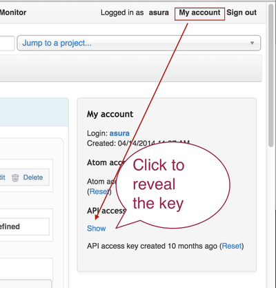

# redman

Welcome to the REDmineMANager (**redman**) tool page.

This tool can save some of your time when doing repetitive actions such as
copying stories and tasks from one sprint to a new one.

The target user-base for the redman tool is anybody using
[redmine](http://www.redmine.org) in combination with the 
[redmine backlogs plugin](https://github.com/backlogs/redmine_backlogs).

# Setup

The redman tool is compatible with python 2.7 so please create a virtual
environment for python 2.7 if your computer setup uses python 3 by default.

For more instructions on how to use virtual environments please got to
[https://virtualenv.pypa.io/en/latest/](https://virtualenv.pypa.io/en/latest/).

Please install the python requirements first:

<pre>
git clone git@github.com:ctsit/redman.git
cd redman
pip install -r requirements.txt
</pre>

# Usage

- Create one or more template sprints in Redmine using the web interface.

Note: In the next steps we will assume that you already created a sprint
called `TEMPLATE_SPRINT_GREEN` and we will use it to run our tool.

- Create the fabric.py file in which we configure the tool:

<pre>
cp sample.fabric.py production/fabric.py
</pre>

- Edit the production/fabric.py file lines which contain
information about redmine:

<pre>
api_url: https://your_redmine_url.com
api_key: some_long_string_you_can_get_from_my_account_page_under_api_access_key (see the screenshots section below)
sprint_name_green: 'TEMPLATE_SPRINT_GREEN'
</pre>

- Run the redman tool:

<pre>
fab production copy_sprint_template_green
or
make prod_green
</pre>

# Screenshots

Obtaining the Redmine API access key:

An example of session using the redman tool:

# Contributors

The application was written by Andrei Sura with tremendous support and fedback
from the entire
[CTS-IT team](https://www.ctsi.ufl.edu/research/study-development/informatics-consulting/).
