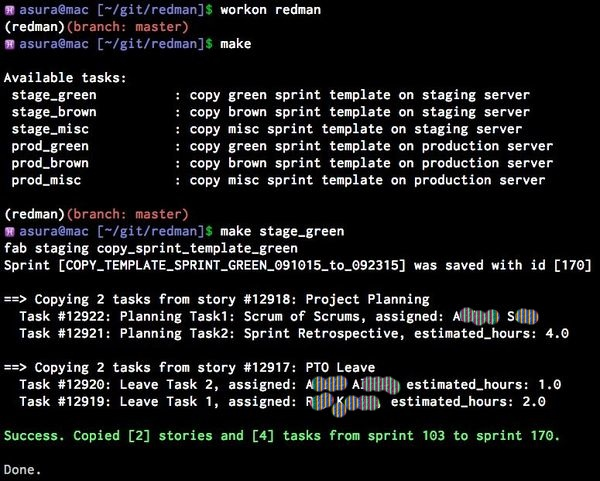

# redman

Welcome to the REDmineMANager (**redman**) tool page.

This tool can save some of your time when doing repetitive actions such as
copying stories and tasks from one sprint to a new one.

The target user-base for the redman tool is anybody using
[redmine](http://www.redmine.org) in combination with the 
[redmine backlogs plugin](https://github.com/backlogs/redmine_backlogs).

# Setup

Please install the python requirement first:

<pre>
pip install -r requirements.txt
</pre>

# Usage

- Create one or more template sprints in Redmine using the web interface.
Note: the names of the templates will be used by the redman tool to create sprint
copies.

- Create and update the fabric.py file to reflect your needs:

<pre>
mkdir production
cp sample.fabric.py production/fabric.py
</pre>

- Run the redman tool:

<pre>
fab production copy_sprint_template_green
or
make prod_green
</pre>

# Screenshots

An example of session using the redman tool:

# Contributors

The application was written by Andrei Sura with tremendous support and fedback
from the entire
[CTS-IT team](https://www.ctsi.ufl.edu/research/study-development/informatics-consulting/).
